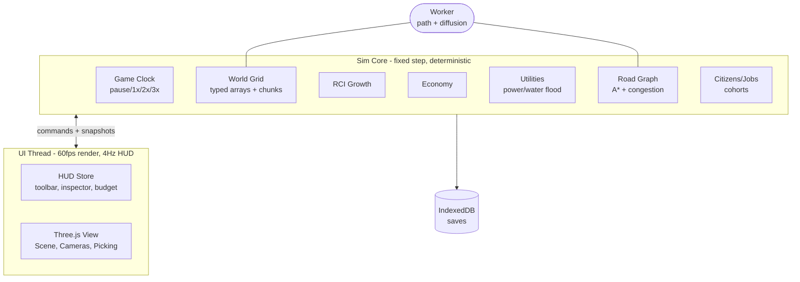

# PLAN.md — Technical Architecture & Build Plan

> How we build `spec.md`. Every section references FR-/NFR- IDs. No code here — decisions + contracts only.

## 1. Tech Stack (locked for MVP)

| Layer | Choice | Why |
|-------|--------|-----|
| Language | **TypeScript strict** | Sim bugs are type bugs; strict null checks pay off |
| Build | **Vite 6** | Fast HMR, code-splitting, worker support |
| Render | **Three.js ≥r170** (WebGL2) | Instancing, ortho+persp, post-FX; WebGPU behind flag later |
| Sim | Hand-rolled fixed-step + typed arrays | No ECS lib needed yet; keep cache-friendly, deterministic |
| Workers | 1 sim helper worker (pathfinding/diffusion) | Keep main thread <50ms/day |
| UI | Minimal reactive store (Zustand-style, ~50 lines or lib) + plain CSS | Avoid heavy framework; HUD updates at 4Hz not 60fps |
| Persist | IndexedDB (idb) + `pako` gzip | Binary tiles compress 5–10× |
| Test | Vitest + Playwright | Unit sim determinism + E2E placement |
| Lint | ESLint + Prettier | CI-gated |

**Commands** (must exist before T-001 completes):
- `npm run dev` — Vite dev, `http://localhost:5173`
- `npm run build` — typecheck + bundle
- `npm run test` — vitest run (sim)
- `npm run e2e` — playwright (placement/save flows)
- `npm run perf` — headless sim benchmark (ticks/sec + day-ms)

## 2. Architecture Overview



**Golden rule:** Sim never imports Three.js. View is a pure projection of sim state (`renderSnapshot`). This keeps sim testable headless + deterministic (FR-S06, NFR-07).

## 3. Module Breakdown & Contracts

### 3.1 `world/` — Grid + Terrain (FR-W01..04)
- `Grid.ts`: `Uint8/16/32Array` layers: `terrain, zone, road, building, powerNet, waterNet, landValue, pollution`. Size `N×N`, `N=256` default, `TILE=8m`.
- `chunks`: 16×16 tiles; dirty flags drive re-mesh + re-cull.
- API: `getTile(x,y)`, `setZone(rect,zone)`, `setRoad(path,type)`, `onChange(cb)`.
- Terrain gen: seeded value-noise + falloff island + water level; `seed` in save header.

### 3.2 `engine/` — Clock + Loop (FR-S01)
- Fixed accumulator: `SIM_DT = 1 game-hour`. Speeds map to ticks/sec: 1x=2, 2x=6, 3x=12. Render decoupled via `requestAnimationFrame`.
- Update order per tick: `utilities → jobs/agents → traffic → growth → economy(monthly) → fields diffusion (worker)`.
- Exposes `tickMs` EMA for F3 overlay (NFR-01).

### 3.3 `growth/` — RCI + Buildings (FR-S02..05)
- Demand: `demand[R,C,I] = clamp(-100..100, f(unemployment, happiness, taxes, landValue))` — exact weights in `docs/03`.
- Score per candidate tile: `desirability × landValueFit × serviced(power+water+road) × random(seed)`.
- Levels 1–3; upgrade needs score > threshold for K consecutive days.
- Abandon if unpowered 30d OR happiness < 25 for 20d OR taxes > 15% for 30d.

### 3.4 `agents/` + `traffic/` — Citizens & Roads (FR-C01..06)
- **Road graph:** nodes = intersections/dead-ends, edges = road runs with `length, lanes, speed, capacity`. Rebuilt incrementally on road edit (dirty chunks only).
- **Cohorts:** aggregate by (homeChunk → workChunk). Cap ~2k cohorts. Visual cars sample top flows.
- **Pathfinding:** A* with binary heap, weight = `length/speed × BPR(v/c)`. Cache per cohort, invalidate on graph version bump. Heavy batches → worker.
- **BPR:** `t = t0 × (1 + 0.15×(v/c)^4)`. LOS F when v/c > 1.0.
- Details + pseudocode: `docs/04`.

### 3.5 `utilities/` — Power & Water (FR-U01..03)
- **Power:** union-find / BFS flood over conductors (lines + roads + buildings). Each net: `supply = Σ plants`, `demand = Σ consumers`. If demand > supply → brownout: shed Industrial farthest-first (decision for OQ-02), mark `powered=false`.
- **Water:** same nets + pressure: `pressure = 1 − dist×k − load×m`; needs > 0.3 to count as watered.
- Recompute on edit + every game-day (not every tick).

### 3.6 `economy/` — Treasury (FR-E01..05)
- Monthly tick (every 30 days): `taxIncome = Σ levelBase[zone][level] × rate[zone] × happinessFactor`; `expenses = Σ upkeep`.
- Start $20,000. Costs table in `docs/05`. Bankruptcy at < −$5,000 → block placements, force budget modal.
- Sparkline: ring buffer of last 12 months.

### 3.7 `view/` — Three.js Projection (FR-R01..07)
- `SceneManager`: renderer, ACES, fog, resize, quality presets.
- `CameraRig`: Ortho ↔ Persp toggle preserving target; damped orbit/pan/zoom; min/max distance; ground clamp.
- `Picking`: raycast against ground plane math (not meshes) → tile coords; hover highlight plane + ghost mesh.
- `Meshers`: `TerrainMesh` (1 draw), `RoadMesh` (merged per chunk), `BuildingInstancer` (InstancedMesh per archetype × level), `PropInstancer` (trees/lamps), `AgentPool` (cars/peds), `OverlayPlanes` (power/traffic/value).
- Night: emissive window texture atlas + shader uniform `nightFactor`; no extra real lights.
- Full spec: `docs/01`.

### 3.8 `ui/` — HUD (FR-X01..05)
- 4Hz subscription to sim snapshot (not per-frame). Components: TopBar, Toolbar, Inspector, BudgetModal, Minimap (2D canvas from grid), Alerts, Advisors, Tutorial, Settings.
- Minimap renders from `zone + road` layers at 128px, updates on chunk dirty.

### 3.9 `persistence/` — Saves (FR-P01..04)
- Format v1: `{ header: JSON, tiles: gzip(base64 of concatenated layers), entities: JSON }`. Version + migration chain. Hash (FNV-1a) of tiles for save/load equality test.
- Slots: `manual[3] + autosave[1]` in IndexedDB; autosave every 5 min + every game-year.

## 4. Data Models (essentials)

```ts
// Tile (logical view; stored as parallel typed arrays)
type Zone = 0|1|2|3; // none,R,C,I
interface TileView { terrain: number; zone: Zone; road: number; building: number; powered: boolean; watered: boolean; landValue: number; }
// Building entity (only for developed tiles, ~10k max)
interface Building { id: number; x: number; y: number; w: number; h: number; zone: Zone; level: 1|2|3; residents: number; jobs: number; upkeep: number; powered: boolean; watered: boolean; connected: boolean; abandoned: boolean; }
// Road edge
interface RoadEdge { a: number; b: number; tiles: number[]; lengthM: number; lanes: number; speedKph: number; capacity: number; volume: number; }
// Cohort
interface Cohort { home: number; work: number; count: number; pathEdgeIds: number[]; distM: number; }
// Save header
interface SaveHeader { version: 1; seed: number; size: number; date: {y:number;m:number;d:number}; playTimeMin: number; hash: string; }
```

## 5. Key Design Decisions (ADRs — summarized)

| # | Decision | Rationale | Revisit if |
|---|----------|-----------|------------|
| 01 | Sim/view split, no Three in sim | Determinism + headless tests | Never |
| 02 | Typed arrays + chunks | 256²=65k tiles must tick fast | Map >512² |
| 03 | Cohorts + sampled visuals (not full agents) | 100k citizens @ 60fps impossible 1:1 | WebGPU crowd sim later |
| 04 | A* + cache + worker | Commutes only change on graph/demand change | Transit adds modes |
| 05 | Brownout sheds I-first, farthest-first | Protects homes, realistic-ish | Playtest says unfair |
| 06 | Roads conduct power/water (like SC2013-lite) | Less pipe micromanagement, fun faster | Hardcore mode later |
| 07 | Procedural buildings v1, GLTF packs later | Zero art bottleneck, tiny bundle | Artist joins |

## 6. Milestones (your 5 phases → 7 gated milestones)

| M | Name | Spec coverage | Exit gate |
|---|------|---------------|-----------|
| M1 | Core Engine & Viz | FR-R01..03, FR-W01, FR-S01 | Pan/zoom/select @60fps empty map; F3 shows fps+tick |
| M2 | Tools & Assets | FR-T01..03, FR-R04, FR-X01 | Place roads/zones/bulldoze with costs; instanced render |
| M3 | Sim Loop (RCI) | FR-S02..05, FR-C01..02, FR-E01..03 | Houses spawn, pop grows, RCI bars move, treasury ticks |
| M4 | Traffic & Utilities | FR-C03..06, FR-U01..03 | Commutes + congestion overlay; brownouts work |
| M5 | Economy UI + Saves | FR-E04..05, FR-P01..04 | Budget panel + sparkline; save/load hash-equal |
| M6 | AAA Render + Feel | FR-R04..07, FR-A01 | Night + LOD + post + audio; <200 draws @10k |
| M7 | Polish & Ship | FR-X02..05, FR-A02..03, NFRs | Tutorial, advisors, disasters, settings, perf gates pass |

## 7. Testing Strategy

- **Unit (Vitest):** growth scoring, A* correctness, BPR math, flood fill, economy, save hash — 80%+ on `sim/`.
- **E2E (Playwright):** UJ-01 script (road→power→zone→pop>0), save/load roundtrip, congestion appears.
- **Perf:** `npm run perf` asserts day-tick p95 <50ms on reference city fixture; draw-call counter assert in dev.
- **Gates:** no milestone merges with failing tests or >300-line PRs.

## 8. Risks & Mitigations

| Risk | Impact | Mitigation |
|------|--------|-----------|
| A* too slow on 256² | Tick blowout | Cache + worker + HPA* fallback (districts) |
| Draw calls explode | FPS death | Instancing + chunk merge + LOD (docs/01) |
| Save bloat | Slow IO | Binary layers + gzip; cap entities |
| Sim indeterminism | Untestable | Seeded RNG everywhere; no Date.now in sim |
| Scope creep (transit/multiplayer) | Never ships | Feature flags; stretch after M5 |

## 9. Open Questions → Resolved

- OQ-01 cohorts+visuals: **yes** (ADR-03).
- OQ-02 brownout: **shed Industrial farthest-from-plant first**, then C, then R; UI lists shed count.
- OQ-03 road hierarchy: MVP = street only; avenue/highway in M6 behind flag.
- OQ-04 undo: MVP = single-batch undo (last drag); full stack in M7 if time.

---
*Next: `tasks.md` (atomic tasks) and `docs/01..07` (deep dives).*
